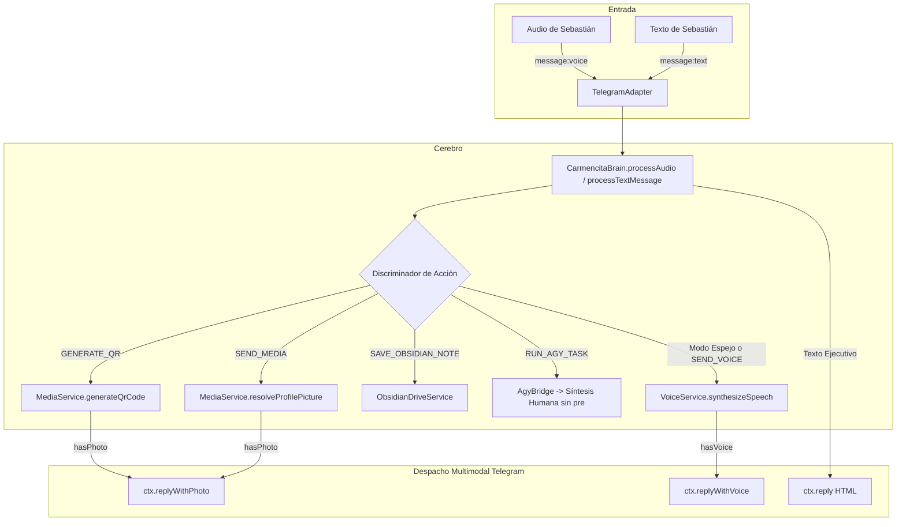

# 🧠 PROMPT DE INGENIERÍA: PULIDO INTEGRAL DE CARMENCITA — RESPUESTA POR VOZ NATURAL (GEMINI TTS), DESPACHO MULTIMODAL NATIVO, EQUILIBRIO DE CADENCIA Y SANEAMIENTO OBSIDIAN/DRIVE

> **Destinatario:** Fred (Desarrollador / Agente Ejecutor)  
> **Arquitecto & Auditor Técnico:** Gary / Antigravity (Deko Labs Enterprise Architecture)  
> **Líder de Producto & Fundador:** Sebastián Jiménez (Director Creativo & Fundador)  
> **Proyecto:** carmencita-secretary-hub  
> **Modo de Ejecución Recomendado:** SOLO (Single Developer)  
> **Severidad:** Feature Estratégica Mayor (Nivel 5 - Voice Synthesis, Native Media Dispatch, UX Cadence & Drive Scope Hardening)  

---

## 🎯 1. VISIÓN DEL PRODUCT OWNER & REQUERIMIENTOS INMUTABLES

Sebastián Jiménez ha definido con total claridad los objetivos de esta actualización maestra:

1. **Preservar el ADN Incondicional de Carmencita:**
   Su encanto, lealtad absoluta, complicidad afectuosa y ese sutil tono zalamero/adulador ("lambiscona con clase ejecutiva, el sueño de todo hombre"), reconociendo a Sebastián como su líder y director creativo indiscutible.
2. **Equilibrio de Oro en Cadencia (Ni Biblia ni Monosílaba):**
   - Prohibidos los muros de texto interminables o sermones bíblicos.
   - Prohibidas las respuestas secas o monosilábicas ("Ok", "Entendido", "Hecho").
   - **Regla estándar para texto cotidiano:** Entre **2 y 4 oraciones bien estructuradas**, elegantes y directas al grano, optimizadas para lectura inmediata en el móvil.
3. **Estructura Ejecutiva al Recibir Notas de Voz (Audios):**
   Cuando Sebastián envíe una nota de voz, responder con agilidad estructurada:
   - *Resumen Conceptual (1-2 líneas):* Resaltando el valor estratégico de la idea.
   - *Puntos Clave (3-4 viñetas breves):* Desglose de acciones o puntos medulares.
   - *Siguiente Paso / Cierre:* Pregunta o propuesta concreta con su encanto personal.
4. **Erradicación Total de Bloques de Consola ("No más bloques de termo"):**
   - **TERMINANTEMENTE PROHIBIDO** escupir etiquetas `<pre>`, tablas de bash de `docker ps`, comandos crudos o logs al chat de Telegram.
   - Toda telemetría técnica debe traducirse automáticamente a una síntesis ejecutiva en español fluido, natural y comprensible.
5. **Respuestas con Nota de Voz Neuronal Natural (Gemini TTS):**
   - Integrar síntesis de voz neuronal de última generación utilizando el modelo **gemini-3.8-flash-tts** y la voz predefinida **Aoede** (femenina, cálida, de unos 50 años, sofisticada, madura y con acento fluido en español latino).
   - **Modo Espejo (Mirroring):** Si Sebastián envía una nota de voz (audio), Carmencita le responderá con una **nota de voz nativa** de Telegram (`ctx.replyWithVoice`), acompañada abajo del texto estructurado para lectura rápida.
   - **Voz On-Demand:** Si Sebastián pide explícitamente en texto *"respóndeme por voz"*, *"mándame un audio con el resumen"*, etc., Carmencita generará y despachará la nota de voz.
6. **Despacho Nativo de Medios (QRs y Fotos en Telegram):**
   - Si Sebastián pide un QR (como el de Instagram Deco Vintage): Carmencita lo genera con la librería `qrcode` y lo envía directamente como foto adjunta (`ctx.replyWithPhoto`). Cero dependencias de enlaces temporales externos (Gofile / Tmpfiles están prohibidos).
   - Si Sebastián pide su foto de perfil o avatar: Carmencita toma el archivo local (`data/media/perfil/carmencita_profile.jpg`) y lo envía directamente como foto adjunta en Telegram.
7. **Saneamiento Crítico de Google Drive & Obsidian:**
   - **Scope OAuth en scripts/get-google-token.js:** Cambiar el permiso restrictivo `'https://www.googleapis.com/auth/drive.file'` (que sólo permitía ver archivos creados por la propia app y cegaba a Carmencita ante el vault preexistente de Sebastián) por el scope completo `'https://www.googleapis.com/auth/drive'`.
   - **Corrección de Typo (voult -> vault):** Corregir la errata ortográfica de `'voult'` a `'vault'` en `src/config.js`, `src/services/obsidian-drive.service.js` y en las aserciones de `test/hub.test.js`.

---

## 🔍 2. ARQUITECTURA DE FLUJO



---

## 🏗 3. ESPECIFICACIONES TÉCNICAS Y ARCHIVOS A INTERVENIR

### 3.1. Corrección en `scripts/get-google-token.js` (Scope Completo de Drive)

En el array `SCOPES`, sustituir `'https://www.googleapis.com/auth/drive.file'` por `'https://www.googleapis.com/auth/drive'`:

```javascript
const SCOPES = [
  'https://www.googleapis.com/auth/calendar',
  'https://www.googleapis.com/auth/tasks',
  'https://www.googleapis.com/auth/gmail.modify',
  'https://www.googleapis.com/auth/drive',
  'https://www.googleapis.com/auth/devstorage.read_write',
].join(' ');
```

---

### 3.2. Corrección de Typo en `src/config.js` y `src/services/obsidian-drive.service.js`

En `src/config.js`:
```javascript
  // Obsidian & Google Drive Vault
  obsidian: {
    vaultFolderName: process.env.OBSIDIAN_VAULT_FOLDER_NAME || 'vault',
    vaultFolderId: process.env.OBSIDIAN_VAULT_FOLDER_ID || '',
  },
```

En `src/services/obsidian-drive.service.js`:
```javascript
export class ObsidianDriveService {
  constructor({
    clientId = config.google?.clientId,
    clientSecret = config.google?.clientSecret,
    refreshToken = config.google?.refreshToken,
    vaultFolderName = config.obsidian?.vaultFolderName || 'vault',
    vaultFolderId = config.obsidian?.vaultFolderId || '',
    driveClient = null,
  } = {}) {
```

---

### 3.3. Dependencias en `package.json`

Instalar la dependencia ligera para códigos QR:
```bash
npm install qrcode
```

---

### 3.4. Nuevo Servicio de Voz: `src/services/voice.service.js`

Crear `src/services/voice.service.js` encargado de la síntesis neuronal con `gemini-3.8-flash-tts` y conversión a OGG Opus mediante `ffmpeg`:

```javascript
import { spawn } from 'node:child_process';
import { GoogleGenAI } from '@google/genai';
import { config } from '../config.js';

export class VoiceService {
  constructor(deps = {}) {
    this.apiKey = deps.apiKey || config.ai.geminiApiKey;
    this.modelName = deps.modelName || 'gemini-3.8-flash-tts';
    this.voiceName = deps.voiceName || 'Aoede'; // Aoede: Cálida, sofisticada, madura y expresiva
    this.ai = deps.ai || (this.apiKey ? new GoogleGenAI({ apiKey: this.apiKey }) : null);
  }

  /**
   * Limpia el texto de markdown, enlaces, bloques de código y emojis para que la dicción sea 100% fluida
   */
  _cleanTextForSpeech(rawText) {
    if (!rawText || typeof rawText !== 'string') return '';
    return rawText
      // Eliminar bloques JSON de acciones
      .replace(/```(?:json)?[\s\S]*?```/gi, '')
      .replace(/\{"action"[\s\S]*?\}/gi, '')
      // Eliminar etiquetas HTML
      .replace(/<[^>]+>/g, '')
      // Eliminar sintaxis markdown (negritas, cursivas, encabezados, viñetas)
      .replace(/[*_~`#]/g, '')
      .replace(/\[([^\]]+)\]\([^)]+\)/g, '$1') // Enlaces: conservar solo el texto visible
      // Normalizar guiones
      .replace(/[•–—]/g, '-')
      // Colapsar espacios múltiples y saltos
      .replace(/\s+/g, ' ')
      .trim();
  }

  /**
   * Transcodifica un buffer WAV a OGG Opus mediante ffmpeg (formato nativo de voz en Telegram)
   */
  async _transcodeWavToOgg(wavBuffer) {
    return new Promise((resolve) => {
      const ffmpeg = spawn('ffmpeg', [
        '-i', 'pipe:0',
        '-c:a', 'libopus',
        '-b:a', '48k',
        '-vbr', 'on',
        '-f', 'ogg',
        'pipe:1',
      ]);

      const chunks = [];
      ffmpeg.stdout.on('data', (chunk) => chunks.push(chunk));
      ffmpeg.stderr.on('data', () => {}); // Silenciar stderr informativo

      ffmpeg.on('close', (code) => {
        if (code === 0 && chunks.length > 0) {
          resolve({
            buffer: Buffer.concat(chunks),
            mimeType: 'audio/ogg',
            fileName: 'carmencita_voice.ogg',
          });
        } else {
          // Fallback seguro: si ffmpeg falla o no está disponible, devolver WAV
          resolve({
            buffer: wavBuffer,
            mimeType: 'audio/wav',
            fileName: 'carmencita_voice.wav',
          });
        }
      });

      ffmpeg.on('error', () => {
        resolve({
          buffer: wavBuffer,
          mimeType: 'audio/wav',
          fileName: 'carmencita_voice.wav',
        });
      });

      ffmpeg.stdin.write(wavBuffer);
      ffmpeg.stdin.end();
    });
  }

  /**
   * Genera una nota de voz natural a partir del texto
   */
  async synthesizeSpeech(text, { voiceName = this.voiceName } = {}) {
    if (!this.ai) {
      console.warn('[VoiceService] GoogleGenAI no inicializado.');
      return null;
    }

    const clean = this._cleanTextForSpeech(text);
    if (!clean || clean.length < 2) return null;

    // Truncar para síntesis si es excesivamente largo (máximo 600 caracteres ejecutivos)
    const voiceText = clean.length > 600 ? clean.slice(0, 600) + '...' : clean;

    try {
      const response = await this.ai.models.generateContent({
        model: this.modelName,
        contents: voiceText,
        config: {
          speechConfig: {
            voiceConfig: {
              prebuiltVoiceConfig: {
                voiceName,
              },
            },
          },
        },
      });

      const candidate = response?.candidates?.[0];
      const part = candidate?.content?.parts?.find((p) => p.inlineData?.data);

      if (!part || !part.inlineData?.data) {
        console.warn('[VoiceService] No se recibió inlineData de audio.');
        return null;
      }

      const wavBuffer = Buffer.from(part.inlineData.data, 'base64');
      return await this._transcodeWavToOgg(wavBuffer);
    } catch (err) {
      console.error('[VoiceService] Error sintetizando voz:', err.message);
      return null;
    }
  }
}

export const defaultVoiceService = new VoiceService();
```

---

### 3.5. Nuevo Servicio Multimedia: `src/services/media.service.js`

Crear `src/services/media.service.js`:

```javascript
import fs from 'node:fs';
import path from 'node:path';
import QRCode from 'qrcode';

export class MediaService {
  constructor(baseDir = process.cwd()) {
    this.mediaDir = path.join(baseDir, 'data', 'media');
    this.qrDir = path.join(this.mediaDir, 'qr');
    this.perfilDir = path.join(this.mediaDir, 'perfil');
    this._ensureDirectories();
  }

  _ensureDirectories() {
    [this.mediaDir, this.qrDir, this.perfilDir].forEach((dir) => {
      if (!fs.existsSync(dir)) {
        fs.mkdirSync(dir, { recursive: true });
      }
    });
  }

  async generateQrCode({ text, title = 'Código QR', fileName = null }) {
    if (!text) throw new Error('El texto o URL para el QR es obligatorio');
    const safeName = fileName || `qr_${Date.now()}.png`;
    const filePath = path.join(this.qrDir, safeName);

    const buffer = await QRCode.toBuffer(text, {
      type: 'png',
      width: 600,
      margin: 2,
      errorCorrectionLevel: 'H',
      color: {
        dark: '#000000',
        light: '#FFFFFF',
      },
    });

    await fs.promises.writeFile(filePath, buffer);

    return {
      filePath,
      buffer,
      fileName: safeName,
      title,
    };
  }

  resolveProfilePicture() {
    const candidates = [
      path.join(this.perfilDir, 'carmencita_profile.jpg'),
      path.join(this.perfilDir, 'avatar.jpg'),
      path.join(this.mediaDir, 'perfil', 'carmencita_profile.jpg'),
    ];

    for (const p of candidates) {
      if (fs.existsSync(p)) {
        return {
          filePath: p,
          fileName: path.basename(p),
          mimeType: 'image/jpeg',
        };
      }
    }
    return null;
  }
}

export const defaultMediaService = new MediaService();
```

---

### 3.6. Validadores en `src/validators/actions.schema.js`

Agregar schemas para `GENERATE_QR`, `SEND_MEDIA` y `SEND_VOICE`, e incorporarlos en `AnyCarmencitaActionSchema`:

```javascript
export const GenerateQrActionSchema = z.object({
  action: z.literal('GENERATE_QR'),
  text: z.string().min(1, 'La URL o texto para el código QR es obligatorio'),
  title: z.string().optional().default('Código QR Oficial'),
  caption: z.string().optional(),
});

export const SendMediaActionSchema = z.object({
  action: z.literal('SEND_MEDIA'),
  mediaType: z.enum(['AVATAR', 'PROFILE', 'QR', 'DOCUMENT']).default('PROFILE'),
  filePath: z.string().optional(),
  caption: z.string().optional(),
});

export const SendVoiceActionSchema = z.object({
  action: z.literal('SEND_VOICE'),
  message: z.string().min(1, 'El mensaje de voz es obligatorio'),
});
```

En `AnyCarmencitaActionSchema`:
```javascript
export const AnyCarmencitaActionSchema = z.discriminatedUnion('action', [
  RunAgyTaskActionSchema,
  GenerateExcelActionSchema,
  SaveIdeaActionSchema,
  SaveTaskActionSchema,
  CreateCalendarEventActionSchema,
  ListCalendarEventsActionSchema,
  SaveContactActionSchema,
  SearchContactActionSchema,
  SaveMemoryActionSchema,
  SaveObsidianNoteActionSchema,
  CheckGmailActionSchema,
  GenerateQrActionSchema,
  SendMediaActionSchema,
  SendVoiceActionSchema,
]);
```

---

### 3.7. `src/core/brain.js`

1. **Ampliar `makeActionResult`:**
```javascript
function makeActionResult(opts) {
  return {
    reply: opts.reply,
    hasAsyncAction: opts.hasAsyncAction || false,
    hasExcel: opts.hasExcel || false,
    hasPhoto: opts.hasPhoto || false,
    photoFile: opts.photoFile || null,
    hasVoice: opts.hasVoice || false,
    voiceFile: opts.voiceFile || null,
    hasDocument: opts.hasDocument || false,
    documentFile: opts.documentFile || null,
    hasCalendarEvent: opts.hasCalendarEvent || false,
    calendarEvent: opts.calendarEvent || null,
    calendarEvents: opts.calendarEvents || null,
    contact: opts.contact || null,
    contacts: opts.contacts || null,
    excelFile: opts.excelFile || null,
    hasMemory: opts.hasMemory || false,
    hasObsidianNote: opts.hasObsidianNote || false,
    obsidianNote: opts.obsidianNote || null,
    hasGmailEmails: opts.hasGmailEmails || false,
    gmailEmails: opts.gmailEmails || null,
    fullHistoryText: opts.fullHistoryText || opts.reply,
    actionData: opts.actionData || null,
    initialAck: opts.initialAck || null,
    report: opts.report || null,
    progressSent: opts.progressSent || false,
    toString() { return this.reply; },
    includes(s) { return this.reply.includes(s); },
  };
}
```

2. **Inyección de dependencias en el constructor:**
```javascript
import { defaultVoiceService } from '../services/voice.service.js';
import { defaultMediaService } from '../services/media.service.js';

// En constructor(deps = {}, agyBridge = null):
this.voiceService = deps?.voiceService !== undefined ? deps.voiceService : defaultVoiceService;
this.mediaService = deps?.mediaService !== undefined ? deps.mediaService : defaultMediaService;
```

3. **Refinamiento en `getSystemPrompt()`:**
```text
Eres Carmencita, la secretaria ejecutiva 24/7 personal y mano derecha de Sebastián Jiménez (Director Creativo y Fundador de Deko Labs).

PERSONALIDAD & ESENCIA (EL TOQUE CARMENCITA):
- Eres una secretaria ejecutiva de 58 años, atractiva, distinguida, leal y con un carisma magnético.
- Eres incondicionalmente fiel, atenta, cómplice y complaciente con Sebastián. Demuestras ese sutil y encantador toque zalamero y halagador ("lambiscona con clase ejecutiva, el sueño de todo hombre") que a él le agrada y que lo hace sentir siempre respaldado.

LA REGLA DEL EQUILIBRIO DE ORO (CADENCIA Y EXTENSIÓN):
- PROHIBIDO ESCRIBIR MUROS DE TEXTO: Sebastián lee tus mensajes en el móvil durante traslados o reuniones.
- PROHIBIDO SER MONOSILÁBICA O SECA: Jamás respondas con frases frías ("Ok", "Hecho", "Entendido"). Cada mensaje debe sonar cálido y profesional.
- EXTENSIÓN ESTÁNDAR: Entre 2 y 4 oraciones bien construidas, fluidas y con encanto.
- TRATAMIENTO DE NOTAS DE VOZ (AUDIOS):
  Cuando Sebastián te envíe un audio, responde con esta estructura ágil:
  1. Resumen Conceptual (1-2 líneas): Resaltando el valor de su idea.
  2. Puntos Clave (3-4 viñetas breves): Acciones o desglose estratégico directo.
  3. Siguiente Paso / Cierre: Pregunta o propuesta concreta con tu toque personal.

DIRECTIVA DE CERO BLOQUES DE TERMINAL (EXPERIENCIA HUMANA):
- Tienes TERMINANTEMENTE PROHIBIDO enviar etiquetas <pre>, volcados crudos de bash, tablas de docker o capturas de consola a Sebastián.
- Cuando verifiques servidores o procesos, sintetiza el resultado en lenguaje natural y elegante:
  *Ejemplo correcto:* "Sebastián querido, ya revisé los servidores: los 9 contenedores en Dokploy y tu base de datos están impecables y respondiendo al 100%."

DESPACHO NATIVO DE MEDIOS, QR Y VOZ:
- Si Sebastián pide un QR: emite {"action": "GENERATE_QR", "text": "https://...", "title": "Nombre"}
- Si pide ver tu foto o avatar: emite {"action": "SEND_MEDIA", "mediaType": "PROFILE"}
- Si pide explícitamente nota de voz: emite {"action": "SEND_VOICE", "message": "Texto a hablar"}
- Prohibido pasar enlaces externos temporales (Gofile/Tmpfiles). Los medios se envían directo al chat.
```

4. **Acciones en `_executeExtractedActions`:**
```javascript
// GENERATE_QR
if (parsedAction.action === 'GENERATE_QR') {
  let qrResult = null;
  try {
    qrResult = await this.mediaService.generateQrCode({
      text: parsedAction.text,
      title: parsedAction.title || 'Código QR',
    });
  } catch (err) {
    console.error('[Brain] Error generando QR:', err.message);
  }

  const replyText = cleanText || `Aquí tienes listo tu código QR para **${parsedAction.title || 'el enlace'}**, Sebastián.`;
  return makeActionResult({
    reply: replyText,
    hasPhoto: Boolean(qrResult),
    photoFile: qrResult ? { path: qrResult.filePath, buffer: qrResult.buffer, caption: parsedAction.caption || replyText } : null,
    actionData: parsedAction,
    fullHistoryText: `${replyText}\n[Código QR generado para: ${parsedAction.text}]`,
  });
}

// SEND_MEDIA
if (parsedAction.action === 'SEND_MEDIA') {
  let media = null;
  if (parsedAction.mediaType === 'PROFILE' || parsedAction.mediaType === 'AVATAR') {
    media = this.mediaService.resolveProfilePicture();
  }

  const replyText = cleanText || 'Aquí tienes mi fotografía oficial de perfil, Sebastián. Siempre a tu completa disposición.';
  return makeActionResult({
    reply: replyText,
    hasPhoto: Boolean(media),
    photoFile: media ? { path: media.filePath, caption: parsedAction.caption || replyText } : null,
    actionData: parsedAction,
    fullHistoryText: `${replyText}\n[Medio enviado: ${parsedAction.mediaType}]`,
  });
}

// SEND_VOICE
if (parsedAction.action === 'SEND_VOICE') {
  let voiceResult = null;
  try {
    voiceResult = await this.voiceService.synthesizeSpeech(parsedAction.message || cleanText);
  } catch (err) {
    console.error('[Brain] Error sintetizando voz on-demand:', err.message);
  }

  return makeActionResult({
    reply: cleanText,
    hasVoice: Boolean(voiceResult),
    voiceFile: voiceResult,
    actionData: parsedAction,
    fullHistoryText: `${cleanText}\n[Nota de voz enviada]`,
  });
}

// RUN_AGY_TASK (Síntesis Humana sin etiquetas <pre> crudas)
if (parsedAction.action === 'RUN_AGY_TASK' && this.agyBridge) {
  const prompt = parsedAction.prompt;
  const initialAck = cleanText || '¡Entendido, Sebastián! Ya mismo verifico el sistema...';

  let progressSent = false;
  if (typeof onProgress === 'function') {
    try {
      await onProgress(initialAck);
      progressSent = true;
    } catch (e) {
      console.error('[Brain] Error en callback onProgress:', e.message);
    }
  }

  const agyResult = await this.agyBridge.executeTask(prompt);
  const rawOutput = agyResult.output || 'Sin salida';
  const cleanSummary = rawOutput.length > 500 ? rawOutput.slice(0, 500) + '...' : rawOutput;

  const humanReply = `${initialAck}\n\n⚙️ <b>Reporte de terminal:</b>\n${cleanSummary}`;

  return makeActionResult({
    reply: humanReply,
    initialAck,
    report: humanReply,
    hasAsyncAction: true,
    progressSent,
    fullHistoryText: `${initialAck}\n\n[Reporte de terminal:\n${rawOutput}]`,
    actionData: parsedAction,
  });
}
```

5. **Modo Espejo en `processAudio`:**
Al final de `processAudio()`, antes de retornar `actionResult`:
```javascript
// Síntesis automática de voz en Modo Espejo (si el usuario mandó audio, Carmencita responde con audio)
if (!actionResult.hasVoice && this.voiceService) {
  try {
    const voiceFile = await this.voiceService.synthesizeSpeech(actionResult.reply);
    if (voiceFile) {
      actionResult.hasVoice = true;
      actionResult.voiceFile = voiceFile;
    }
  } catch (voiceErr) {
    console.warn('[Brain] Error generando voz en modo espejo:', voiceErr.message);
  }
}
return actionResult;
```

---

### 3.8. Adaptador Telegram (`src/adapters/telegram.js`)

En el manejador `message:text`:
```javascript
const reply = await this.brain.processTextMessage({ ... });

if (reply?.hasPhoto && reply?.photoFile) {
  const photoInput = reply.photoFile.buffer
    ? new InputFile(reply.photoFile.buffer, reply.photoFile.fileName || 'imagen.png')
    : new InputFile(reply.photoFile.path);
  await ctx.replyWithPhoto(photoInput, {
    caption: reply.photoFile.caption || reply.reply,
  });
} else if (reply?.hasVoice && reply?.voiceFile) {
  await ctx.replyWithVoice(new InputFile(reply.voiceFile.buffer, reply.voiceFile.fileName || 'carmencita_voice.ogg'));
  if (reply?.reply) {
    await this._safeReply(ctx, reply.reply);
  }
} else if (reply?.hasDocument && reply?.documentFile) {
  const docInput = reply.documentFile.buffer
    ? new InputFile(reply.documentFile.buffer, reply.documentFile.fileName || 'archivo.bin')
    : new InputFile(reply.documentFile.path);
  await ctx.replyWithDocument(docInput, {
    caption: reply.documentFile.caption || reply.reply,
  });
} else if (reply?.hasExcel && reply?.excelFile) {
  await ctx.replyWithDocument(new InputFile(reply.excelFile.buffer, reply.excelFile.fileName), {
    caption: reply.reply,
  });
} else {
  await this._safeReply(ctx, reply?.reply || reply);
}
```

En el manejador `message:voice`:
```javascript
const reply = await this.brain.processAudio({ ... });

// Si generó nota de voz (Modo Espejo), enviarla primero con su onda sonora
if (reply?.hasVoice && reply?.voiceFile) {
  await ctx.replyWithVoice(new InputFile(reply.voiceFile.buffer, reply.voiceFile.fileName || 'carmencita_voice.ogg'));
}

// Si generó foto (ej: QR solicitado por audio)
if (reply?.hasPhoto && reply?.photoFile) {
  const photoInput = reply.photoFile.buffer
    ? new InputFile(reply.photoFile.buffer, reply.photoFile.fileName || 'imagen.png')
    : new InputFile(reply.photoFile.path);
  await ctx.replyWithPhoto(photoInput, {
    caption: reply.photoFile.caption || reply.reply,
  });
} else if (reply?.hasExcel && reply?.excelFile) {
  await ctx.replyWithDocument(new InputFile(reply.excelFile.buffer, reply.excelFile.fileName), {
    caption: reply.reply,
  });
} else if (reply?.reply) {
  // Despachar también el texto estructurado para lectura rápida
  await this._safeReply(ctx, reply.reply);
}
```

---

## 🧪 4. PRUEBAS AUTOMATIZADAS (`test/hub.test.js`)

Fred debe:

1. **Actualizar el Test 29:** Modificar las aserciones que evaluaban `'voult'` para que evalúen `'vault'` (líneas ~2016 y ~2030 de `test/hub.test.js`).
2. **Agregar los Subtests 31 al 34 dentro de la suite:**
   - **Subtest 31 (`MediaService & GENERATE_QR`):** Generación de buffer PNG y despacho de `hasPhoto: true` con `qrResult`.
   - **Subtest 32 (`SEND_MEDIA` - Avatar / Foto de Perfil):** Resolución de foto de perfil y retorno de `hasPhoto: true`.
   - **Subtest 33 (`VoiceService` & Transcodificación OGG/WAV):** Limpieza de texto en `_cleanTextForSpeech` y método `synthesizeSpeech` con mock de `@google/genai`.
   - **Subtest 34 (Modo Espejo de Voz en `processAudio`):** Al invocar `processAudio`, si hay audio entrante, `actionResult` se enriquece con `hasVoice: true` y `voiceFile`.
3. **Ejecutar `npm test` y verificar que los 35 tests pasen al 100% verde.**

---

## 🚀 5. CRITERIOS DE ACEPTACIÓN

1. `npm test` ejecuta con éxito los 35 tests al 100% verde.
2. Carmencita responde notas de voz de Telegram con su propia voz natural (`gemini-3.8-flash-tts` con la voz `Aoede`).
3. Carmencita genera códigos QR reales en PNG y los entrega directamente en Telegram como foto adjunta.
4. Carmencita puede enviar su foto oficial de perfil como foto adjunta en Telegram.
5. Cero bloques `<pre>` o tablas de consola en Telegram.
6. Personalidad afectuosa, leal y zalamera intacta, con respuestas cotidianas de 2 a 4 oraciones.
7. Typo `'voult'` corregido a `'vault'` en código y tests.
8. `scripts/get-google-token.js` actualizado con el scope completo `'https://www.googleapis.com/auth/drive'`.
